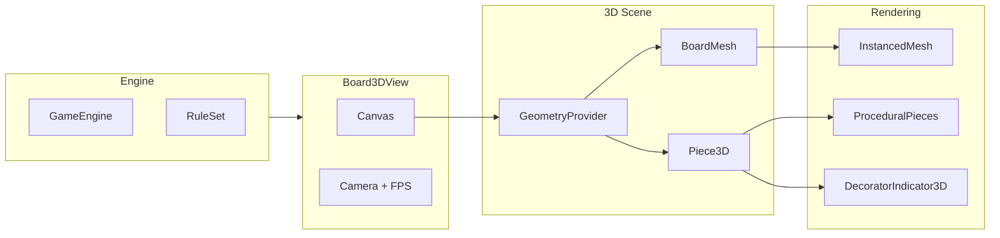
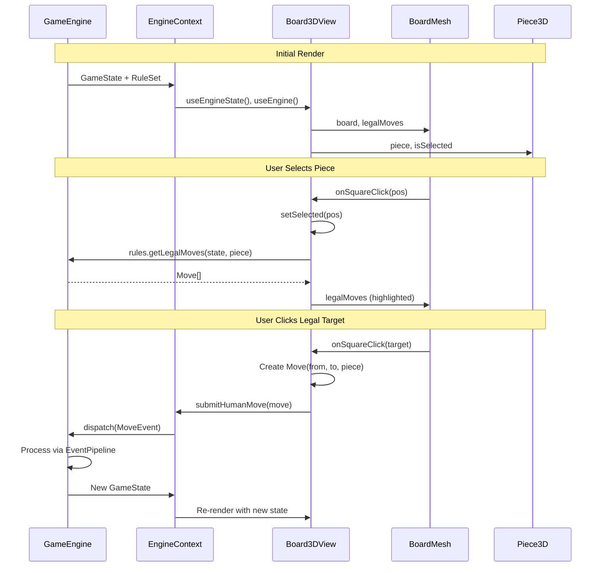

# 3D Chess Renderer

React Three Fiber-based 3D renderer for the chess engine.

## Architecture



## Component Overview

| Component              | Purpose                                                            |
| ---------------------- | ------------------------------------------------------------------ |
| `Board3DView`          | Root component. Manages selection, camera, and FPS display         |
| `BoardMesh`            | Renders board squares via `InstancedMesh` (single draw call)       |
| `Piece3D`              | Renders individual piece with decorators. Memoized for performance |
| `ProceduralPieces`     | Procedural geometry for each piece type (Pawn, Rook, etc.)         |
| `DecoratorIndicator3D` | Visual indicators for piece decorators                             |
| `GeometryStore`        | Context provider caching shared geometries and materials           |
| `coordinates`          | Grid ↔ world coordinate conversions                               |

## Data Flow



## Performance Optimizations

- **InstancedMesh**: Board renders 64 squares in 1 draw call instead of 64
- **GeometryStore**: Cached geometries/materials shared across all pieces
- **React.memo**: `BoardMesh` and `Piece3D` skip re-renders when props unchanged
- **Ref-based FPS**: Counter writes to ref, display reads on separate interval (no canvas re-render)

## Coordinate System

```
Grid (0,0)          World Origin (0,0,0)
    ↓                      ↓
┌───────────┐         Board centered
│ 0,7 → 7,7 │         at world origin
│     ↓     │
│ 0,0 → 7,0 │         Y = up
└───────────┘         X/Z = horizontal plane
```

`gridToWorld()` converts grid position to world coordinates, centering the board at origin.

## File Structure

```
chess3d/
├── Board3DView.tsx      # Root scene + controls
├── BoardMesh.tsx        # Instanced board squares
├── Piece3D.tsx          # Piece wrapper + selection
├── DecoratorIndicator3D.tsx
├── coordinates.ts       # Grid ↔ world math
└── pieces/
    ├── GeometryStore.tsx    # Cached geometry context
    └── ProceduralPieces.tsx # Piece geometry definitions
```
